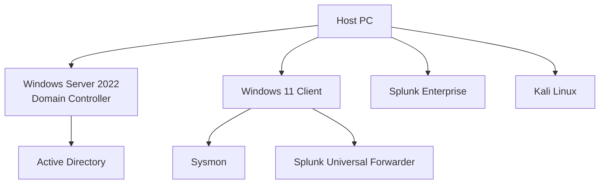
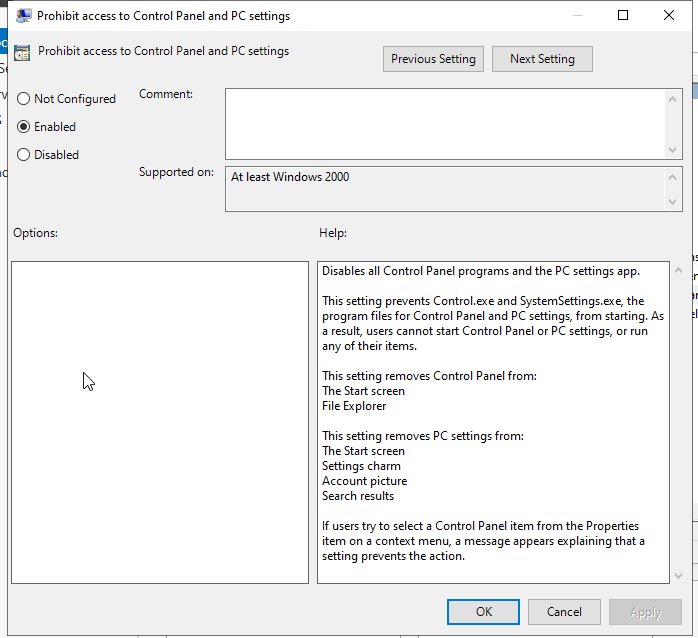
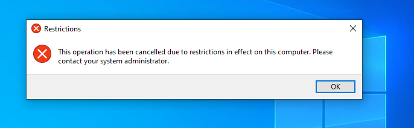
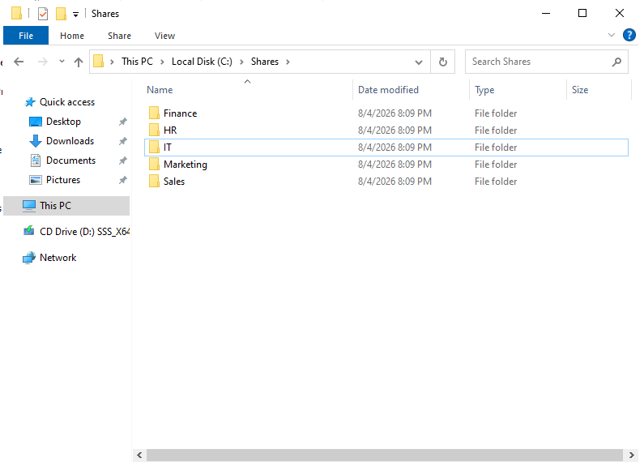
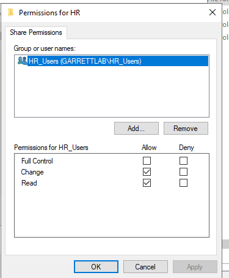
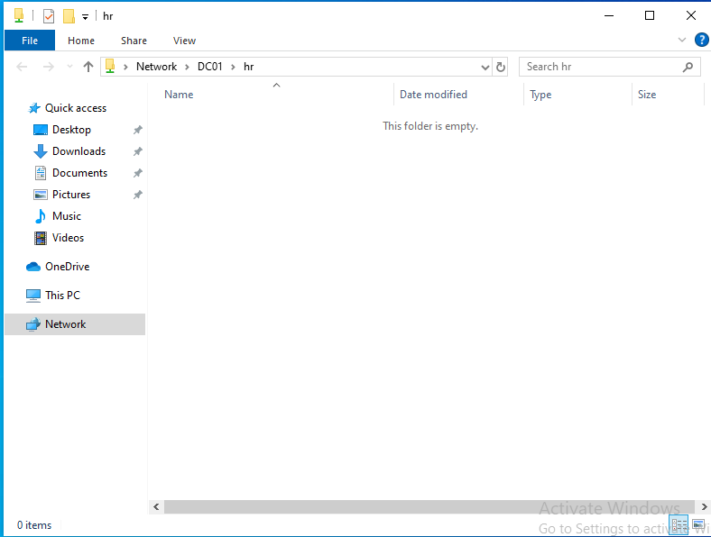
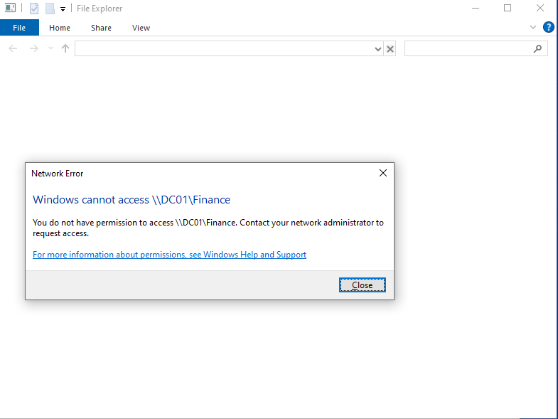

# Active-Directory-Home-Lab

## Overview
This project documents the creation of a Windows enterprise lab using Active Directory Domain Services. The environment simulates a small business network with centralized authentication, Group Policy management, shared resources, and Windows security monitoring.

## Technologies Used
- Windows Server 2022
- Windows 10
- Active Directory Domain Services
- Kali Linux
- Splunk Enterprise
- Splunk Universal Forwarder
- Sysmon
- Atomic Red Team
- VirtualBox

## Lab Architecture 



The enviornment consists of four virtual machines running in a shared VirtualBox NAT Network.

- Windows Server 2022 acts as the Domain Controller
- Windows 10 is joined to the Active Directory domain.
- Sysmon collects endpoint telemetry.
- Splunk Enterprise receives and analyzes Windows logs.
- Kali Linux is used to simulate attacker activity. 

## Active Directory Domain Services

### Objective
Configure the Windows Server as a domain controller.

### Steps Performed
- Installed the Active Directory Domain Services role.
- Promoted the server to a domain controller.
- Created the domain.
- Verified successful installation.

### Screenshots


### Active Directory
Created the following Organizational Units: 

- IT
- HR
- Finance
- Marketing
- Sales
- Servers
- Service Accounts
- Workstations


Created user accounts:
- Jenny Smith (jsmith)
- Terry Roberts (troberts)
- Elisabeth Lowe 
- Umar Peterson
- Darius Nash
- Marilyn Sutton
- Vinnie Nelson
- Phillip Cole
- Zaviyan Cobb
- Jean Riley
- Kelsie Kirk
- Elle Vang
- Maison Craig


Created Secuirty Groups to simplify permission management by assinging permissions to groups instead of individual users.

- Finance_Users
- HR_Users
- IT_Admins
- IT_Users
- Marketing_Users
- Sales_Users


---

## Group Policy Management 

To gain hands-on experience with Active Directory administration, I created and deployed Group Policy Objects (GPOs) to manage user settings across Organizational Units (OUs).

### Desktop Wallpaper GPO

**Objective:** Apply a standardized desktop wallpaper to users in the **IT** Organizational Unit.

**Configuration:**
- Created a new GPO named **IT - Desktop Wallpaper**.
- Configured the **Desktop Wallpaper** policy under **User Configuration**.
- Stored the wallpaper in a shared folder on the domain controller and referenced it using a **UNC path** (`\\DC01\Share\Wallpaper.jpg`).
- Applied the policy using `gpupdate /force` and verified it on the client workstation.

### Evidence


### Control Panel Restriction

**Objective:** Restrict access to the Control Panel and Windows Settings for users in the **HR** Organizational Unit.

**Configuration:**
- Created a new GPO named **HR - Disable Control Panel**.
- Enabled the **Prohibit access to Control Panel and PC settings** policy.
- Linked the GPO to the **HR** Organizational Unit.
- Applied the policy setting and verified that HR users could no longer access Control Panel.

### Evidence




--- 

### Skills Demonstrated
- Active Directory Group Policy Managment
- Organizational Unit Administration
- User-Based Policy Deployment
- UNC File Shares
- Group Policy Troubleshooting
- Windows Domain Administration 

---

## Shared Folders & Permissions

### Objectives

Configure department specific file shares and implement role-based access control (RBAC) using Active Directory security groups.

### Configuration

- Created shared folders for each department
- Configured SMB shares on the domain controller
- Assigned Share and NFTS permissions using department-specific security groups.
- Verified that users could access only the resources assigned to their department.

### Evidence









### Skills Demonstrated

- Windows File Sharing
- NTFS Permissions
- SMB Shares
- Active Directory Security Groups
- Role-based Access Control (RBAC)
- Permission Troubleshooting

--- 


# Attack Simulations

## Attack Simulation #1 - Local User Account Creation

### Objective
Simulate an attacker creating a local user account to establish persistence on a Windows system.

### Tool
- Atomic Red Team

### MITRE ATT&CK
- **T1136.001 - Create Account: Local Account**

### Description
Executed the Atomic Red Team test to create a local Windows user account. This activity generates Windows Security logs that can be collected and analyzed in Splunk.

### Detection
**Relevant Windows Event IDs**
- Event ID 4720 – User account created
- Event ID 4732 – User added to a local security group (if applicable)

### Splunk Search
```spl
index=endpoint EventCode=4720
```

### Evidence

![Atomic Red Team - Local User Creation]


### Outcome
Successfully generated Windows security events that were ingested into Splunk and identified using Event ID 4720.

---

## Attack Simulation #2 - PowerShell Execution

### Objective
Simulate malicious PowerShell execution to generate endpoint telemetry for detection and analysis.

### Tool
- Atomic Red Team

### MITRE ATT&CK
- **T1059.001 - PowerShell**

### Description
Executed an Atomic Red Team PowerShell test to simulate adversary behavior. The execution generated endpoint telemetry collected by Sysmon and forwarded to Splunk.

### Detection
Potential logs to investigate:
- Sysmon Event ID 1 – Process Creation
- PowerShell Event ID 4104 – Script Block Logging (if enabled)
- Windows Security Logs (depending on the test executed)

### Splunk Search

```spl
index=endpoint powershell
```

or

```spl
index=endpoint EventCode=1
```

### Evidence


### Outcome
Successfully generated PowerShell execution telemetry and verified that the events were searchable within Splunk.

---

## Skills Demonstrated

- Active Directory Administration
- Windows Event Logging
- Sysmon Configuration
- Splunk Log Analysis
- Endpoint Detection
- Atomic Red Team
- MITRE ATT&CK Mapping
- Threat Detection
- Security Event Investigation
