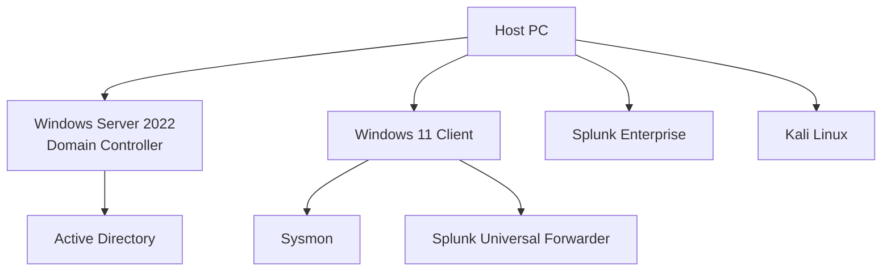

# Active-Directory-Home-Lab

## Overview
This project documents the creation of a Windows enterprise lab using Active Directory Domain Services. The environment simulates a small business network with centralized authentication, Group Policy management, shared resources, and Windows security monitoring.

## Technologies

## Lab Architecture 

## Active Directory Domain Services

### Objective
Configure the Windows Server as a domain controller.

### Steps Performed
- Installed the Active Directory Domain Services role.
- Promoted the server to a domain controller.
- Created the domain.
- Verified successful installation.

### Screenshots

