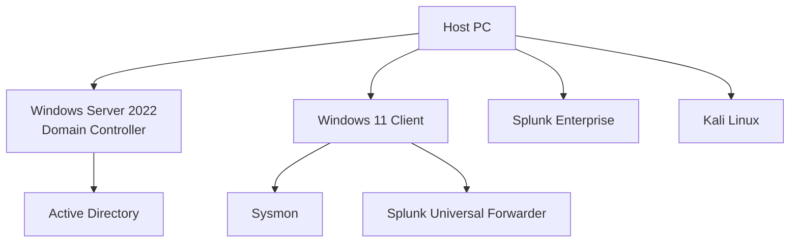
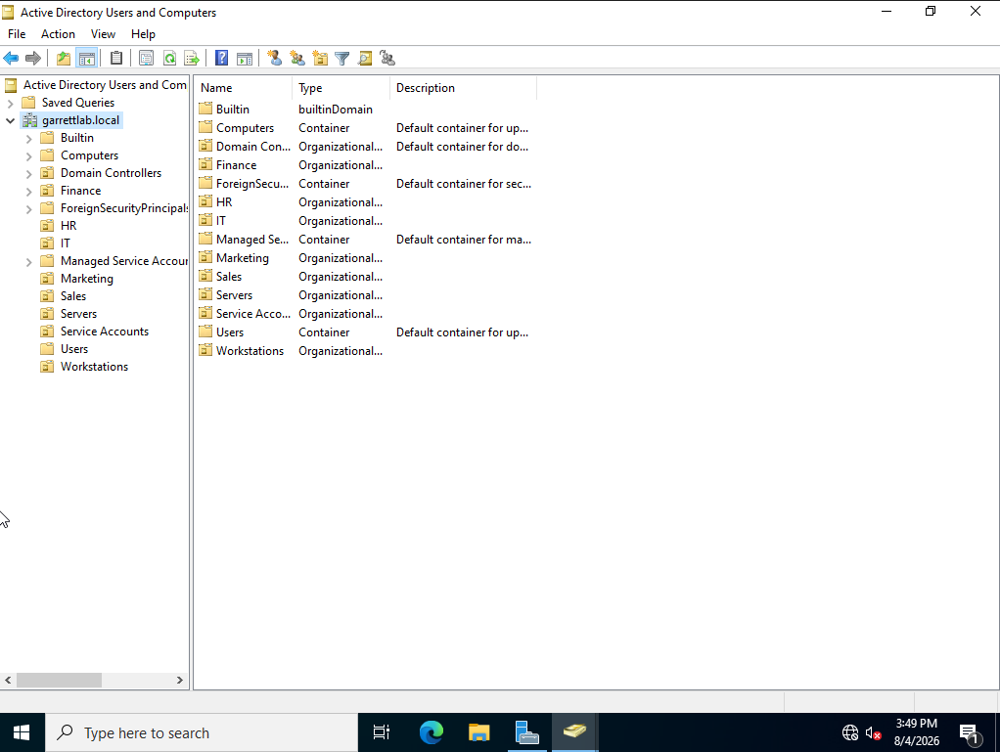
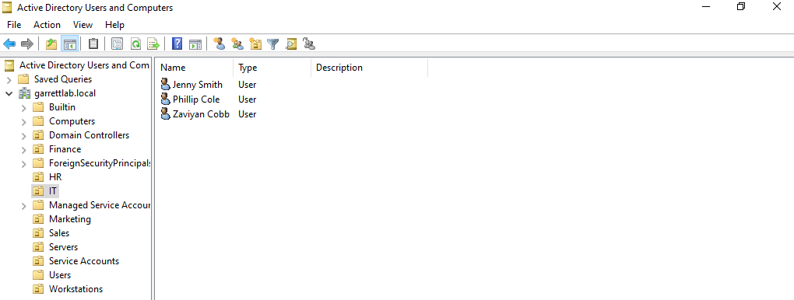
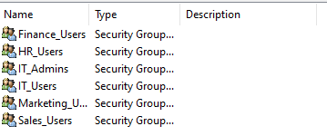
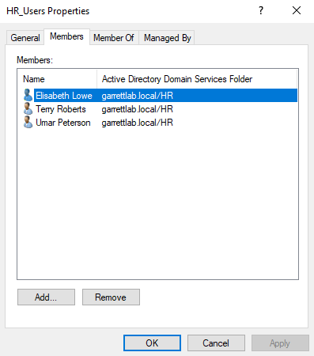
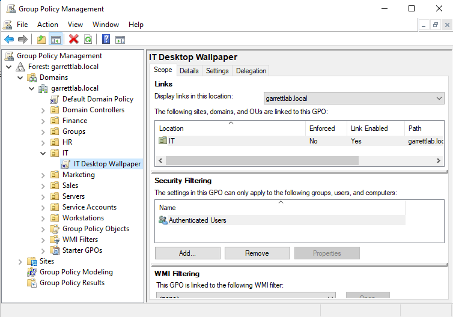
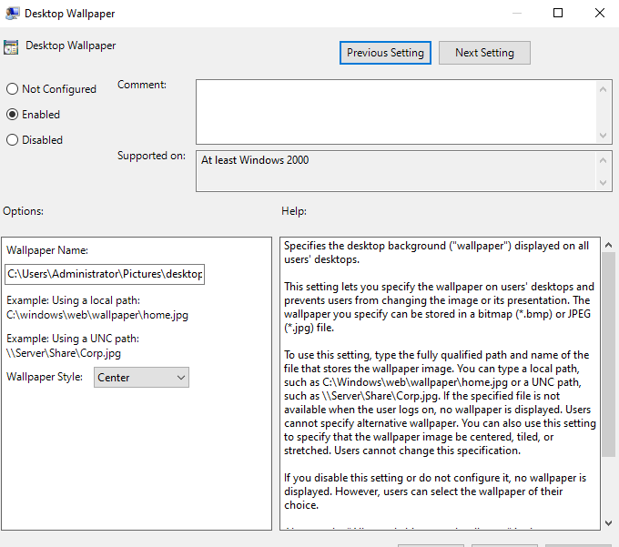
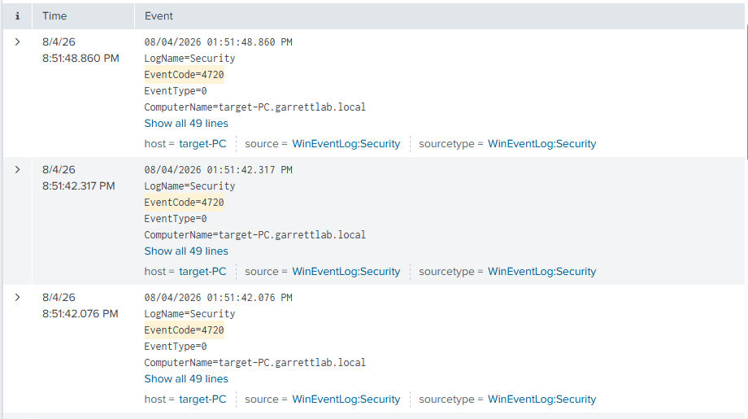

# Active-Directory-Home-Lab

## Overview
This project documents the creation of a Windows enterprise lab using Active Directory Domain Services. The environment simulates a small business network with centralized authentication, Group Policy management, shared resources, and Windows security monitoring.

## Technologies Used
- Windows Server 2022
- Windows 10
- Active Directory Domain Services
- Kali Linux
- Splunk Enterprise
- Splunk Universal Forwarder
- Sysmon
- Atomic Red Team
- VirtualBox


## Lab Architecture 



## Active Directory Domain Services

### Objective
Configure the Windows Server as a domain controller.

### Steps Performed
- Installed the Active Directory Domain Services role.
- Promoted the server to a domain controller.
- Created the domain.
- Verified successful installation.

### Screenshots


### Active Directory
Created the following Organizational Units: 

- IT
- HR
- Finance
- Marketing
- Sales
- Servers
- Service Accounts
- Workstations



Created user accouts:
- Jenny Smith (jsmith)
- Terry Roberts (troberts)
- Elisabeth Lowe 
- Umar Peterson
- Darius Nash
- Marilyn Sutton
- Vinnie Nelson
- Phillip Cole
- Zaviyan Cobb
- Jean Riley
- Kelsie Kirk
- Elle Vang
- Maison Craig



Created the following Security Groups:

- Finance_Users
- HR_Users
- IT_Admins
- IT_Users
- Marketing_Users
- Sales_Users





Desktop Wallpaper GPO

Configured a GPO to manage wallpapers on desktops






---

# Attack Simulations

## Attack Simulation #1 - Local User Account Creation

### Objective
Simulate an attacker creating a local user account to establish persistence on a Windows system.

### Tool
- Atomic Red Team

### MITRE ATT&CK
- **T1136.001 - Create Account: Local Account**

### Description
Executed the Atomic Red Team test to create a local Windows user account. This activity generates Windows Security logs that can be collected and analyzed in Splunk.

### Detection
**Relevant Windows Event IDs**
- Event ID 4720 – User account created
- Event ID 4732 – User added to a local security group (if applicable)

### Splunk Search
```spl
index=endpoint EventCode=4720
```

### Evidence

![Atomic Red Team - Local User Creation]





### Outcome
Successfully generated Windows security events that were ingested into Splunk and identified using Event ID 4720.

---

## Attack Simulation #2 - PowerShell Execution

### Objective
Simulate malicious PowerShell execution to generate endpoint telemetry for detection and analysis.

### Tool
- Atomic Red Team

### MITRE ATT&CK
- **T1059.001 - PowerShell**

### Description
Executed an Atomic Red Team PowerShell test to simulate adversary behavior. The execution generated endpoint telemetry collected by Sysmon and forwarded to Splunk.

### Detection
Potential logs to investigate:
- Sysmon Event ID 1 – Process Creation
- PowerShell Event ID 4104 – Script Block Logging (if enabled)
- Windows Security Logs (depending on the test executed)

### Splunk Search

```spl
index=endpoint powershell
```

or

```spl
index=endpoint EventCode=1
```

### Evidence


### Outcome
Successfully generated PowerShell execution telemetry and verified that the events were searchable within Splunk.

---

## Skills Demonstrated

- Active Directory Administration
- Windows Event Logging
- Sysmon Configuration
- Splunk Log Analysis
- Endpoint Detection
- Atomic Red Team
- MITRE ATT&CK Mapping
- Threat Detection
- Security Event Investigation
